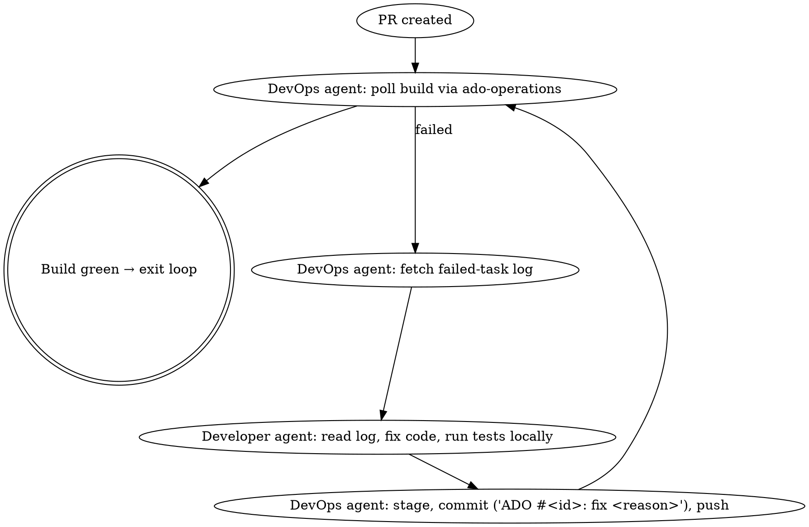

# Shipit — ADO Work Item to Green PR

A pure orchestration skill. Delegate every domain operation to the appropriate sub-skill or specialist agent. Do not re-implement ADO API calls, PR creation logic, or language-specific code patterns inside this skill.

## Inputs

- `WORKITEM_ID` — the numeric ADO work item ID, taken from the slash-command argument or the user's message. If missing, ask the user once and stop until provided.

## Prerequisites

Verify before starting. Stop with a clear error if any are missing:

- `ADO_PAT`, `ADO_ORG`, `ADO_PROJECT` environment variables (used by `ado-workitems` and `ado-operations` skills).
- Current working directory is a git repository with an `origin` remote pointing at Azure DevOps.
- The `superpowers`, `ado-workitems`, and `azure-devops` plugins are installed (their skills must be invocable).

## Operating Principles

- Treat the workflow steps below as a checklist. Create a TodoWrite list with one todo per numbered step (Step 1 … Step 7) at the start, mark each `in_progress` when entering it and `completed` when it ends. Never advance with prior steps incomplete.
- Use sub-skills via the `Skill` tool: `superpowers:brainstorming`, `superpowers:writing-plans`, `superpowers:test-driven-development`, `superpowers:verification-before-completion`, `superpowers:finishing-a-development-branch`, `ado-workitems:ado-workitems`, `azure-devops:ado-operations`.
- Use specialist sub-agents via the `Agent` tool for implementation and DevOps work. The "developer" and "devops" actors below MUST run as separate sub-agents — do not collapse them.
- Persist state (workitem ID, branch name, PR ID, build IDs, short description) in TodoWrite notes so loops below can resume after errors.

## Step 1 — Fetch and Clarify Requirements

1. Invoke the `ado-workitems` skill via `Skill` and use it to fetch the work item: `python3 ${CLAUDE_PLUGIN_ROOT}/scripts/ado-api.py get <WORKITEM_ID>` (the path is provided by the `ado-workitems` plugin, not this one).
2. Extract: title, description, acceptance criteria, attached BRDs. If a `.docx`/`.pdf` BRD is attached, follow the ado-workitems skill's "BRD Extraction Workflow".
3. **Decide clarity**: requirements are clear ONLY if all of the following hold:
   - Acceptance criteria are concrete and testable.
   - The scope (files/components/services) can be identified from the description or by inspecting the repo.
   - There is no contradictory or ambiguous wording.
4. **If unclear**: invoke `superpowers:brainstorming` (Skill tool) and run a clarification session, either with the user or — if the user is not interactive — by enumerating assumptions and choosing the most defensible interpretation. Capture the resulting clarified scope, acceptance criteria, and assumptions as plain markdown.
5. **If clear**: produce a one-paragraph "confirmed requirements" summary instead.

Save the resulting markdown as the variable `CLARIFIED_REQS` (in conversation/notes — not a file unless large).

## Step 2 — Post Clarified Requirements to ADO

Post `CLARIFIED_REQS` as a work-item comment. The `ado-api.py` helper does not expose a comment command, so call the REST endpoint directly using the same auth pattern as `azure-devops:ado-operations`:

```bash
AUTH=$(python3 -c "import base64; print(base64.b64encode((':' + '$ADO_PAT').encode()).decode())")
BASE="https://dev.azure.com/${ADO_ORG}/${ADO_PROJECT}/_apis"

# Convert markdown to a single-line HTML payload safely
BODY=$(python3 -c 'import json,sys; print(json.dumps({"text": sys.stdin.read()}))' <<<"<h3>Clarified requirements (shipit)</h3>$CLARIFIED_REQS_HTML")

curl -sS -f -X POST \
  -H "Authorization: Basic $AUTH" \
  -H "Content-Type: application/json" \
  -d "$BODY" \
  "$BASE/wit/workitems/${WORKITEM_ID}/comments?api-version=7.1-preview.4"
```

Convert markdown to minimal HTML (`<p>`, `<ul>`, `<code>`) before sending — ADO comments render HTML, not Markdown. Skip this step only if Step 1 ended with "requirements were already clear and complete" AND the user explicitly opted out of posting.

## Step 3 — Plan and Post the Plan

1. Invoke `superpowers:writing-plans` (Skill tool) to produce a phased implementation plan covering: scope, file-by-file changes, test strategy (incl. coverage target ≥ 60%), risks, rollout. Use `CLARIFIED_REQS` as the spec.
2. Derive a `SHORT_DESCRIPTION` (≤ 6 lowercase words, hyphenated, e.g. `add-csv-export-endpoint`) from the work item title — this will name the branch and PR.
3. Post the plan as a second ADO work-item comment using the same `curl … /comments` pattern from Step 2. Prepend an `<h3>Implementation plan (shipit)</h3>` heading.

## Step 4 — Implementation Sub-Agent (TDD, ≥ 60 % Coverage)

Detect the dominant language by reading repo signals (e.g. `*.csproj`, `pom.xml`, `build.sbt`, `package.json`, `pyproject.toml`, file extensions). Map it to a specialist agent:

| Language / Stack | `subagent_type` |
|---|---|
| C# / .NET | `jvm-languages:csharp-pro` |
| Java / Spring | `jvm-languages:java-pro` |
| Scala | `jvm-languages:scala-pro` |
| React / TS / frontend | `application-performance:frontend-developer` |
| Anything else | `general-purpose` |

Dispatch the implementation work via the `Agent` tool with `subagent_type` set as above. The agent prompt MUST include, verbatim:

> "Use the `superpowers:test-driven-development` skill. Follow strict red → green → refactor. Achieve **≥ 60% line coverage** for the code you add or modify; verify coverage with the project's existing test runner and report the measured number. Do NOT create branches, do NOT commit, do NOT push — only edit files and run tests in the working tree. Stop when all tests pass and coverage ≥ 60%, then report: list of files changed, command to run the tests, measured coverage."

If the coverage tool is unknown, the implementation agent must determine it from the project (e.g. `dotnet test --collect:"XPlat Code Coverage"`, `mvn test jacoco:report`, `vitest --coverage`, `coverage run -m pytest && coverage report`). If no coverage tool exists in the repo, the agent must add one as part of its plan and still achieve the threshold.

When the agent returns:
- If it reports failure or coverage < 60%, send it a follow-up via the same agent (continue, don't fork) describing exactly what to address. Loop until success or 3 failed attempts — after 3, stop and surface the blocker to the user.

## Step 5 — DevOps Sub-Agent: Branch, Commit, Push, PR

Dispatch a separate `Agent` (use `general-purpose` subagent unless a more specific DevOps agent fits). The prompt MUST include, verbatim, the items below — substitute the real values:

> "Invoke the `azure-devops:ado-operations` skill. Then:
> 1. Create branch `feature/<WORKITEM_ID>_<SHORT_DESCRIPTION>` from current HEAD.
> 2. Stage the files changed in this session and create a single commit with message `ADO #<WORKITEM_ID>: <human-readable description>`. Do NOT use `git add -A`; stage only the files reported by the implementation agent.
> 3. Push the branch with `-u origin`.
> 4. Create a PR into `main` (or `master` if `main` does not exist) using the patterns from the `azure-devops:ado-operations` skill. The PR body MUST include `workItemRefs: [{"id": "<WORKITEM_ID>"}]` so the work item is linked. The PR title must be `ADO #<WORKITEM_ID>: <human-readable description>`. The PR description must summarise the change and reference the work item URL.
> Report back: branch name, commit SHA, PR ID, and PR web URL."

Capture `BRANCH_NAME`, `PR_ID`, `PR_URL`.

## Step 6 — Build Monitor / Fix Loop

Loop until the PR's build pipeline finishes green. Use TWO sub-agents and pass state between them — never let the developer agent push, never let the devops agent edit production code.



Implementation notes:
- Use `azure-devops:ado-operations` "Build Failure Diagnosis Workflow" to fetch the failing task's log. Pass the log excerpt (errors, stack traces, failed test names — not the whole log) to the developer agent.
- The developer fix prompt MUST require running the same TDD cycle: write/adjust a failing test that captures the bug, then fix, then verify locally, then hand back to devops.
- Hard cap: 5 fix iterations. After that, stop and ask the user. Never disable tests, never push `--no-verify`, never bypass branch policies.
- If a failure looks transient (per the ado-operations skill's transient-failure list), the devops agent re-queues the build instead of invoking the developer agent.

When the build is green, proceed to Step 7.

## Step 7 — Wrap-Up

1. Inspect the diff (`git diff origin/main...HEAD`) and decide whether `README.md` and `CLAUDE.md` need updates (new commands, new env vars, new build steps, new public APIs). If yes, edit them in a final commit `ADO #<WORKITEM_ID>: docs` and push. If not, skip — do not invent doc churn.
2. Invoke `superpowers:verification-before-completion` (Skill tool) to sanity-check that the PR truly satisfies the acceptance criteria.
3. Post a final summary comment on the work item using the same comment endpoint as Step 2. The comment MUST include:
   - PR title, PR web URL.
   - Branch name and final commit SHA.
   - Files changed (high-level grouping, not the full list if > 20).
   - Final test count and measured coverage.
   - Any deviations from the plan.

Mark all TodoWrite items completed and report the PR URL plus next-action recommendation (typically: request reviewers / await approval).

## Failure & Stop Conditions

Stop and surface to the user — do not silently continue — when:

- Any prerequisite (env var, plugin, git remote) is missing.
- The work item cannot be fetched (404, auth failure).
- Three consecutive implementation-agent attempts fail.
- Five consecutive build-fix iterations fail.
- Branch policies block push (e.g. signed-commit requirement) — never override.
- The user has interrupted the run.

## What This Skill Deliberately Does NOT Do

- It does not invent new ADO API call patterns — those live in `ado-workitems` and `azure-devops` skills.
- It does not write production code itself — the implementation sub-agent does.
- It does not run `git push` or `git commit` itself — the devops sub-agent does.
- It does not merge or complete the PR. Human approval is required.

## Additional Resources

- `references/comment-template.md` — minimal HTML scaffolds for the three ADO comments (clarified requirements, plan, summary).
- `superpowers:brainstorming`, `superpowers:writing-plans`, `superpowers:test-driven-development`, `superpowers:verification-before-completion`, `superpowers:finishing-a-development-branch` — sub-skills invoked above.
- `ado-workitems:ado-workitems` — work item fetch/update/BRD extraction.
- `azure-devops:ado-operations` — PR creation, build monitoring, log fetching.
