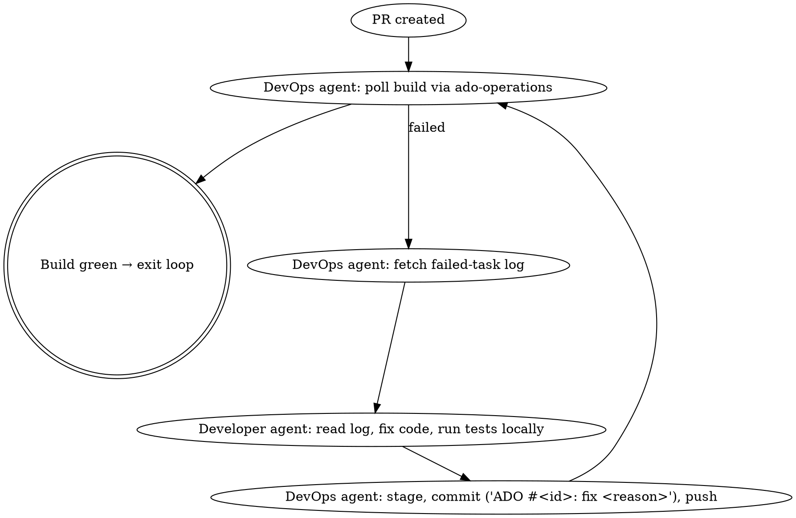

# Shipit — ADO Work Item to Green PR

A pure orchestration skill. Delegate every domain operation to the appropriate sub-skill or specialist agent. Do not re-implement ADO API calls, PR creation logic, or language-specific code patterns inside this skill.

## Inputs

- `WORKITEM_ID` — the numeric ADO work item ID, taken from the slash-command argument or the user's message. If missing, ask the user once and stop until provided.

## Prerequisites

Verify before starting. Stop with a clear error if any are missing:

- `ADO_PAT`, `ADO_ORG`, `ADO_PROJECT` environment variables (used by `ado-workitems` and `ado-operations` skills).
- Current working directory is a git repository with an `origin` remote pointing at Azure DevOps.
- The `superpowers`, `ado-workitems`, and `azure-devops` plugins are installed (their skills must be invocable).

## Operating Principles

- Treat the workflow steps below as a checklist. Create a TodoWrite list with one todo per numbered step (Step 1 … Step 7) at the start, mark each `in_progress` when entering it and `completed` when it ends. Never advance with prior steps incomplete.
- Use sub-skills via the `Skill` tool: `superpowers:writing-plans`, `superpowers:test-driven-development`, `superpowers:dispatching-parallel-agents`, `superpowers:verification-before-completion`, `superpowers:finishing-a-development-branch`, `simplify`, `ado-workitems:ado-workitems`, `azure-devops:ado-operations`.
- **Always simplify after code changes go green.** Every implementation or fix sub-agent must invoke the `simplify` skill (the same code path as the `/simplify` slash command) on the files it just touched, then re-run the tests, before reporting back. This applies in Step 4 and Step 6. Never skip simplify with the rationale "it works already" — that is exactly when it runs.
- Use specialist sub-agents via the `Agent` tool for implementation and DevOps work. The "developer" and "devops" actors below MUST run as separate sub-agents — do not collapse them.
- **Multi-repo parallelism.** When the work touches multiple repositories AND each repo's change has no functional dependency on another (no shared types, no API contract that must land first, no migration ordering), dispatch one sub-agent per repo in a single `Agent` tool-call batch (multiple tool-use blocks in one message). Follow `superpowers:dispatching-parallel-agents`. If repos depend on each other, run them sequentially in dependency order — never break a contract by shipping consumers before producers.
- Persist state (workitem ID, per-repo branch name, per-repo PR ID, per-repo build IDs, short description) in TodoWrite notes so loops below can resume after errors. Track each repo as its own sub-todo when multi-repo.

## Step 1 — Fetch, Assess Clarity, Detect Repo Scope

1. Invoke the `ado-workitems` skill via `Skill` and use it to fetch the work item: `python3 ${CLAUDE_PLUGIN_ROOT}/scripts/ado-api.py get <WORKITEM_ID>` (the path is provided by the `ado-workitems` plugin, not this one).
2. Extract: title, description, acceptance criteria, attached BRDs. If a `.docx`/`.pdf` BRD is attached, follow the ado-workitems skill's "BRD Extraction Workflow".
3. **Decide clarity.** Requirements are clear ONLY if ALL of the following hold:
   - Acceptance criteria are concrete and testable (each criterion implies a passing test).
   - The set of repositories that need to change is identifiable.
   - Within each repo, the scope (files / components / services) can be determined from the description or by inspecting the code.
   - There is no contradictory or ambiguous wording, and no missing information that would force a guess about behaviour, data shapes, or edge cases.
4. **If unclear → STOP after posting a clarification request.** Do NOT brainstorm with the user, do NOT assume, do NOT proceed to Step 2. Instead:
   - Build a numbered list of specific clarifying questions (one question per ambiguity — be precise, not vague).
   - Post the questions as an ADO work-item comment using the comment-posting pattern in Step 2 below, with the heading `<h3>Clarification needed (shipit)</h3>` and a closing line stating that the shipit run has been paused until the questions are answered. See `references/comment-template.md` § "Clarification request".
   - Mark all remaining TodoWrite items as cancelled, report the posted comment URL to the user, and end the task. The user (or work-item owner) re-invokes `/shipit` after updating the work item.
5. **If clear → continue.** Produce a one-paragraph "confirmed requirements" summary as `CLARIFIED_REQS` (markdown, kept in conversation notes).
6. **Detect repo scope.** From the work item text, attached BRD, and — if needed — the user's confirmation, build `REPOS`: a list of `{path, name, role}` for every repository that must change. The current working directory is repo #1 by default; additional repos must be located on disk (ask the user for their paths if not obvious). Mark each repo `independent: true` if its change has no functional dependency on another repo's change in this work item; otherwise record the dependency edges. Carry `REPOS` through the remaining steps.

## Step 2 — Post Clarified Requirements to ADO

Post `CLARIFIED_REQS` as a work-item comment. The `ado-api.py` helper does not expose a comment command, so call the REST endpoint directly using the same auth pattern as `azure-devops:ado-operations`:

```bash
AUTH=$(python3 -c "import base64; print(base64.b64encode((':' + '$ADO_PAT').encode()).decode())")
BASE="https://dev.azure.com/${ADO_ORG}/${ADO_PROJECT}/_apis"

# Convert markdown to a single-line HTML payload safely
BODY=$(python3 -c 'import json,sys; print(json.dumps({"text": sys.stdin.read()}))' <<<"<h3>Clarified requirements (shipit)</h3>$CLARIFIED_REQS_HTML")

curl -sS -f -X POST \
  -H "Authorization: Basic $AUTH" \
  -H "Content-Type: application/json" \
  -d "$BODY" \
  "$BASE/wit/workitems/${WORKITEM_ID}/comments?api-version=7.1-preview.4"
```

Convert markdown to minimal HTML (`<p>`, `<ul>`, `<code>`) before sending — ADO comments render HTML, not Markdown. Skip this step only if Step 1 ended with "requirements were already clear and complete" AND the user explicitly opted out of posting.

## Step 3 — Plan and Post the Plan

1. Invoke `superpowers:writing-plans` (Skill tool) to produce a phased implementation plan covering: scope, file-by-file changes per repo, test strategy (incl. coverage target ≥ 60%), risks, rollout. Use `CLARIFIED_REQS` and `REPOS` as the spec. When multiple repos are in scope, give each repo its own subsection and call out cross-repo dependencies (or explicitly state "all repos independent").
2. Derive a `SHORT_DESCRIPTION` (≤ 6 lowercase words, hyphenated, e.g. `add-csv-export-endpoint`) from the work item title — this will name every branch and PR. Use the same `SHORT_DESCRIPTION` across repos so they are easy to correlate.
3. Post the plan as a second ADO work-item comment using the same `curl … /comments` pattern from Step 2. Prepend an `<h3>Implementation plan (shipit)</h3>` heading. Include a "Repos in scope" section listing each repo path and whether it is independent.

## Step 4 — Implementation Sub-Agent(s) (TDD, ≥ 60 % Coverage)

For each repo in `REPOS`, detect the dominant language by reading repo signals (e.g. `*.csproj`, `pom.xml`, `build.sbt`, `package.json`, `pyproject.toml`, file extensions). Map it to a specialist agent:

| Language / Stack | `subagent_type` |
|---|---|
| C# / .NET | `jvm-languages:csharp-pro` |
| Java / Spring | `jvm-languages:java-pro` |
| Scala | `jvm-languages:scala-pro` |
| React / TS / frontend | `application-performance:frontend-developer` |
| Anything else | `general-purpose` |

**Dispatch strategy.** Group the repos:

- **Independent repos** (no cross-repo dependency in this work item) → dispatch ALL of their implementation agents in a SINGLE message containing multiple `Agent` tool-use blocks. This is the parallel path; follow `superpowers:dispatching-parallel-agents`.
- **Dependent repos** → dispatch in dependency order, one batch per "level" of the dependency DAG. Within a level, still parallelise.

Each agent prompt MUST include, verbatim (substituting the repo path):

> "Working directory: `<absolute repo path>`. Use the `superpowers:test-driven-development` skill. Follow strict red → green → refactor. Achieve **≥ 60% line coverage** for the code you add or modify in this repo; verify coverage with the project's existing test runner and report the measured number. Do NOT create branches, do NOT commit, do NOT push — only edit files and run tests in the working tree. Do NOT touch any file outside `<absolute repo path>`.
>
> Once all tests pass and coverage ≥ 60%, you MUST invoke the `simplify` skill (Skill tool, name `simplify`) scoped to the files you changed in this session, apply its suggested simplifications, and re-run the test suite to confirm everything still passes and coverage is still ≥ 60%. If simplify regresses tests or coverage, revert that specific simplification and continue with the others.
>
> Stop only after the post-simplify test run is green at coverage. Then report: list of files changed (relative paths), command to run the tests, measured coverage, and a one-line note on what simplify changed (or 'no changes')."

If the coverage tool is unknown, the implementation agent must determine it from the project (e.g. `dotnet test --collect:"XPlat Code Coverage"`, `mvn test jacoco:report`, `vitest --coverage`, `coverage run -m pytest && coverage report`). If no coverage tool exists in the repo, the agent must add one as part of its plan and still achieve the threshold.

When the agents return:
- Aggregate results per repo. If any repo reports failure or coverage < 60%, send a follow-up to that specific agent (continue, don't fork) describing what to address. Other repos that succeeded do not re-run.
- Loop per-repo until success or 3 failed attempts on that repo — after 3, stop and surface the blocker to the user. Do not proceed to Step 5 for any repo until ALL repos in scope are green and at-coverage. (For independent repos, you MAY start Step 5 for a finished repo while others are still working — see Step 5.)

## Step 5 — DevOps Sub-Agent(s): Branch, Commit, Push, PR

Run one DevOps sub-agent **per repo**. When two or more repos finished Step 4 successfully and are independent, dispatch their DevOps agents in a SINGLE message containing multiple `Agent` tool-use blocks (parallel). Dependent repos run in dependency order — but each repo's DevOps work is still its own sub-agent.

Use `general-purpose` as the `subagent_type` unless a more specific DevOps agent fits. The prompt MUST include, verbatim, the items below — substitute the real values per repo:

> "Working directory: `<absolute repo path>`. Invoke the `azure-devops:ado-operations` skill. Then:
> 1. Create branch `feature/<WORKITEM_ID>_<SHORT_DESCRIPTION>` from current HEAD.
> 2. Stage the files changed in this session and create a single commit with message `ADO #<WORKITEM_ID>: <human-readable description>`. Do NOT use `git add -A`; stage only the files reported by the implementation agent for this repo.
> 3. Push the branch with `-u origin`.
> 4. Create a PR into `main` (or `master` if `main` does not exist) using the patterns from the `azure-devops:ado-operations` skill. The PR body MUST include `workItemRefs: [{"id": "<WORKITEM_ID>"}]` so the work item is linked. The PR title must be `ADO #<WORKITEM_ID>: <human-readable description>`. The PR description must summarise the change, reference the work item URL, and — when multiple repos are involved — list the sibling repo PRs (URLs will be filled in once known).
> Report back: repo name, branch name, commit SHA, PR ID, and PR web URL."

Capture per-repo `{repo, BRANCH_NAME, PR_ID, PR_URL}` into a `PRS` collection. After all PRs exist, optionally have one DevOps agent edit each PR's description to backfill the cross-links.

## Step 6 — Build Monitor / Fix Loop (Per PR, Parallel Where Possible)

Run a build-monitor loop **per PR** until that PR's pipeline finishes green. PRs from independent repos run their loops in parallel — each loop is its own sub-agent pair. Dependent PRs follow their dependency order.

For each PR, use TWO sub-agents and pass state between them — never let the developer agent push, never let the devops agent edit production code.



Implementation notes:
- Use `azure-devops:ado-operations` "Build Failure Diagnosis Workflow" to fetch the failing task's log. Pass the log excerpt (errors, stack traces, failed test names — not the whole log) to the developer agent for that repo.
- The developer fix prompt MUST require running the same TDD cycle: write/adjust a failing test that captures the bug, then fix, then verify locally. After local tests pass, the developer agent MUST invoke the `simplify` skill on the files it just changed, re-run tests once more, and only then hand back to devops. The cleanup happens *every* iteration — quick fixes are exactly where simplify earns its keep.
- When polling builds for multiple PRs, batch the polls (one tool-use block per PR in a single message) to keep the loop responsive.
- Hard cap: 5 fix iterations PER PR. After that, stop and ask the user (one PR exceeding the cap does not auto-cancel sibling PRs, but it does block Step 7 for the whole work item). Never disable tests, never push `--no-verify`, never bypass branch policies.
- If a failure looks transient (per the ado-operations skill's transient-failure list), the devops agent re-queues the build instead of invoking the developer agent.

When EVERY PR is green, proceed to Step 7.

## Step 7 — Wrap-Up

For each repo in `REPOS`, run via the per-repo DevOps agent (parallelisable across independent repos):

1. Inspect the diff (`git diff origin/main...HEAD`) and decide whether `README.md` and `CLAUDE.md` need updates (new commands, new env vars, new build steps, new public APIs). If yes, edit them in a final commit `ADO #<WORKITEM_ID>: docs` and push. If not, skip — do not invent doc churn.
2. Invoke `superpowers:verification-before-completion` (Skill tool) once per PR to sanity-check that the PR truly satisfies the acceptance criteria assigned to that repo.

Then, in the main session, post ONE final summary comment on the work item using the same comment endpoint as Step 2. The comment MUST include, for each PR:
- PR title and web URL.
- Branch name and final commit SHA.
- Files changed (high-level grouping, not the full list if > 20).
- Final test count and measured coverage.
- Any deviations from the plan.

When multiple repos are involved, structure the summary as a per-repo section with a top-level "Shipped across N repos" heading.

Mark all TodoWrite items completed and report all PR URLs plus next-action recommendation (typically: request reviewers / await approval — and, for multi-repo, note any merge ordering required by the dependency edges from Step 1).

## Failure & Stop Conditions

Stop and surface to the user — do not silently continue — when:

- Any prerequisite (env var, plugin, git remote) is missing.
- The work item cannot be fetched (404, auth failure).
- Requirements are unclear — post the clarification-request comment from Step 1.4 and END the task.
- Three consecutive implementation-agent attempts fail on a single repo.
- Five consecutive build-fix iterations fail on a single PR.
- Branch policies block push (e.g. signed-commit requirement) — never override.
- The user has interrupted the run.

## What This Skill Deliberately Does NOT Do

- It does not invent new ADO API call patterns — those live in `ado-workitems` and `azure-devops` skills.
- It does not write production code itself — the implementation sub-agent does.
- It does not run `git push` or `git commit` itself — the devops sub-agent does.
- It does not merge or complete the PR. Human approval is required.

## Additional Resources

- `references/comment-template.md` — minimal HTML scaffolds for the three ADO comments (clarified requirements, plan, summary).
- `superpowers:brainstorming`, `superpowers:writing-plans`, `superpowers:test-driven-development`, `superpowers:verification-before-completion`, `superpowers:finishing-a-development-branch` — sub-skills invoked above.
- `ado-workitems:ado-workitems` — work item fetch/update/BRD extraction.
- `azure-devops:ado-operations` — PR creation, build monitoring, log fetching.
